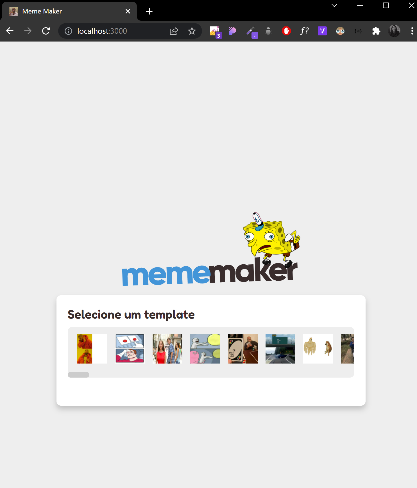
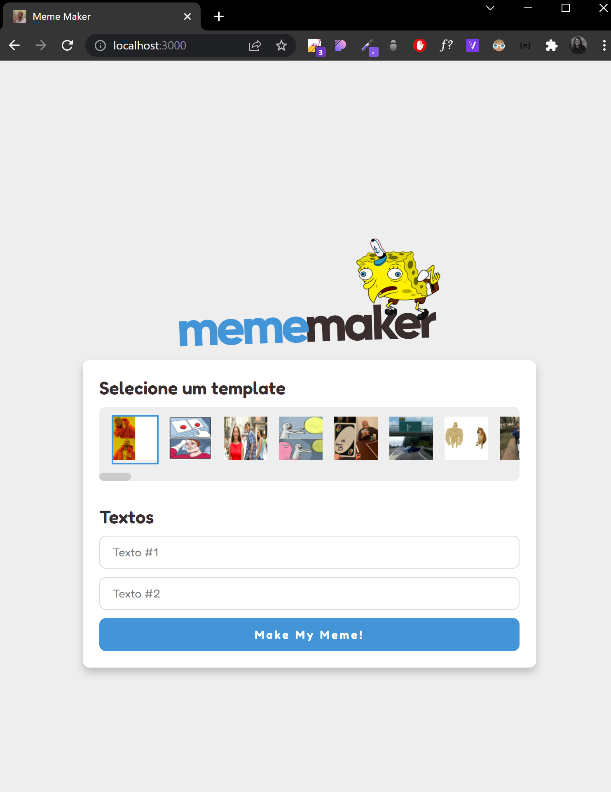

# Meme Maker

---

The **Meme Maker** is a web application that allows you to generate memes.

This application was made with [Mateus Silva](https://www.youtube.com/c/MateusSilvaDev)

🟢 See live: https://nikolas-lopes-mememaker.netlify.app/

### The application was built using:

- React ⚛️
- TypeScript ✏️
- Styled Components 💅🏻
- React Toastify 🔮
- Imgflip API 👾

### How to run the project?

- Download the **_zip_** or **_clone_** project
- Open the terminal and **_execute_**: `cd meme-maker`
- Open the terminal again and **_execute_**: `yarn` to ins stall the dependencies
- Then, run in terminal and **_execute_** again: `yarn dev`
- Open in the `Browser`: [http://localhost:3000](http://localhost:3000/)

### Screenshots

### Support me

- GitHub: [nikolaslopes](https://github.com/nikolaslopes)
- LinkedIn: [nikolas-lopes](https://www.linkedin.com/in/nikolas-lopes-b06524209/)

Thanks for your support (●'◡'●)
